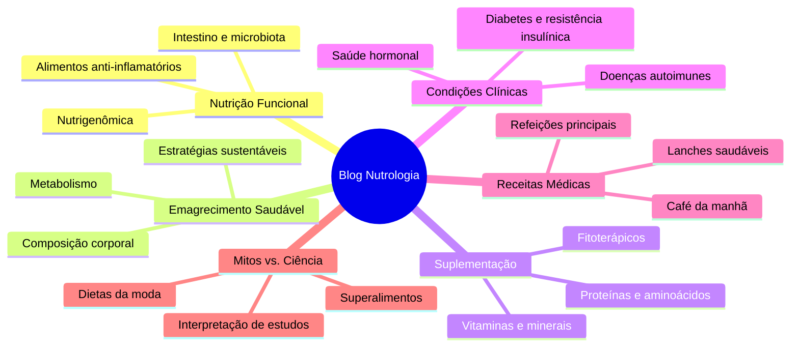
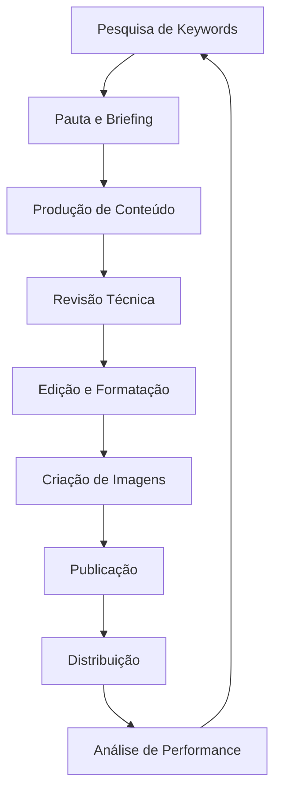

# 📝 ESTRUTURA DO BLOG DE NUTROLOGIA - DRA. AMANDA FERNANDES

Este documento detalha a estrutura recomendada para o blog de Nutrologia da Dra. Amanda Fernandes, incluindo categorias, exemplos de posts, e diretrizes de conteúdo.

## 🎯 OBJETIVOS DO BLOG

- Estabelecer autoridade da Dra. Amanda no campo da Nutrologia
- Educar pacientes e visitantes sobre nutrição médica baseada em evidências
- Desmistificar conceitos errôneos sobre alimentação e suplementação
- Gerar tráfego orgânico através de SEO
- Converter leitores em pacientes

## 📊 ESTRUTURA DE CATEGORIAS



## 📋 EXEMPLOS DE POSTS POR CATEGORIA

### 1. Nutrição Funcional

#### Post 1: "O Eixo Intestino-Cérebro: Como Sua Alimentação Afeta Seu Humor"
- **Resumo:** Exploramos a conexão bidirecional entre o intestino e o cérebro, explicando como a microbiota intestinal influencia neurotransmissores e como uma alimentação anti-inflamatória pode melhorar condições como ansiedade e depressão.
- **Palavras-chave:** microbiota intestinal, saúde mental, probióticos, serotonina, inflamação
- **CTA:** Agende uma consulta para avaliação personalizada da sua saúde intestinal

#### Post 2: "Alimentos Anti-inflamatórios: Guia Completo Baseado em Evidências"
- **Resumo:** Um guia detalhado sobre os alimentos com propriedades anti-inflamatórias comprovadas cientificamente, explicando seus mecanismos de ação e como incorporá-los no dia a dia.
- **Palavras-chave:** inflamação crônica, antioxidantes, ômega-3, polifenóis, curcumina
- **CTA:** Baixe nosso e-book gratuito com receitas anti-inflamatórias

### 2. Emagrecimento Saudável

#### Post 1: "Por Que Dietas Restritivas Falham: A Ciência Por Trás do Efeito Sanfona"
- **Resumo:** Análise dos mecanismos fisiológicos e psicológicos que explicam por que dietas muito restritivas levam ao reganho de peso, e como adotar uma abordagem sustentável para o emagrecimento.
- **Palavras-chave:** metabolismo adaptativo, hormônios da fome, restrição calórica, comportamento alimentar
- **CTA:** Conheça nosso programa de emagrecimento médico sustentável

#### Post 2: "Composição Corporal vs. Peso na Balança: O Que Realmente Importa?"
- **Resumo:** Explicação sobre por que focar apenas no peso pode ser enganoso, e como a avaliação da composição corporal oferece uma visão mais precisa da saúde metabólica.
- **Palavras-chave:** massa magra, percentual de gordura, bioimpedância, metabolismo basal
- **CTA:** Agende sua avaliação de composição corporal com a Dra. Amanda

### 3. Suplementação

#### Post 1: "Vitamina D: Muito Além da Saúde Óssea"
- **Resumo:** Um panorama completo sobre as funções da vitamina D no organismo, incluindo seu papel no sistema imunológico, saúde mental e prevenção de doenças crônicas.
- **Palavras-chave:** deficiência de vitamina D, suplementação, dosagem, 25-hidroxivitamina D, exposição solar
- **CTA:** Solicite seu exame de níveis de vitamina D

#### Post 2: "Proteínas e Aminoácidos: Guia Completo Para Cada Fase da Vida"
- **Resumo:** Explicação sobre as necessidades proteicas em diferentes fases da vida e condições de saúde, tipos de proteínas e suplementos, e como otimizar a síntese proteica.
- **Palavras-chave:** whey protein, aminoácidos essenciais, leucina, sarcopenia, veganismo
- **CTA:** Consulte a Dra. Amanda para um plano nutricional personalizado

### 4. Condições Clínicas

#### Post 1: "Resistência à Insulina: O Que É e Como Reverter Naturalmente"
- **Resumo:** Explicação detalhada sobre a resistência à insulina, seus sinais, consequências para a saúde e estratégias nutricionais e de estilo de vida para melhorar a sensibilidade à insulina.
- **Palavras-chave:** diabetes tipo 2, síndrome metabólica, glicemia, carboidratos, exercício físico
- **CTA:** Faça o teste online de risco para resistência à insulina

#### Post 2: "Nutrição e Autoimunidade: O Papel da Alimentação nas Doenças Autoimunes"
- **Resumo:** Análise da relação entre alimentação, permeabilidade intestinal e doenças autoimunes, com estratégias nutricionais baseadas em evidências para reduzir inflamação e sintomas.
- **Palavras-chave:** Hashimoto, lúpus, artrite reumatoide, protocolo autoimune, glúten
- **CTA:** Agende uma consulta especializada em nutrição para autoimunidade

### 5. Receitas Médicas

#### Post 1: "5 Cafés da Manhã Anti-inflamatórios Aprovados por Nutróloga"
- **Resumo:** Receitas práticas e nutritivas para o café da manhã, formuladas para combater inflamação, estabilizar a glicemia e fornecer energia sustentada ao longo da manhã.
- **Palavras-chave:** café da manhã saudável, baixo índice glicêmico, ômega-3, antioxidantes
- **CTA:** Inscreva-se para receber mais receitas exclusivas

#### Post 2: "Lanches Proteicos Para Controle do Apetite: Receitas Práticas"
- **Resumo:** Opções de lanches equilibrados com foco em proteínas e gorduras saudáveis para controlar o apetite entre as refeições principais e evitar picos de insulina.
- **Palavras-chave:** snacks saudáveis, controle de fome, proteínas, baixo carboidrato
- **CTA:** Baixe nosso guia de lanches saudáveis para a semana

### 6. Mitos vs. Ciência

#### Post 1: "Jejum Intermitente: Separando Fatos de Ficção"
- **Resumo:** Análise crítica das evidências científicas sobre o jejum intermitente, seus benefícios comprovados, limitações e para quem pode ou não ser recomendado.
- **Palavras-chave:** jejum intermitente, autofagia, metabolismo, time-restricted feeding
- **CTA:** Consulte a Dra. Amanda antes de iniciar qualquer protocolo de jejum

#### Post 2: "Superalimentos: Realidade Nutricional ou Marketing?"
- **Resumo:** Investigação sobre o conceito de "superalimentos", analisando as evidências científicas por trás das alegações de marketing e como incorporar alimentos nutritivos sem cair em modismos.
- **Palavras-chave:** superalimentos, antioxidantes, marketing nutricional, alimentos funcionais
- **CTA:** Aprenda a montar um prato verdadeiramente nutritivo em nossa consulta

## 🎨 DESIGN E ESTRUTURA DOS POSTS

### Layout Recomendado

```
┌─────────────────────────────────────┐
│ [Imagem de Destaque]                │
├─────────────────────────────────────┤
│ [Tag da Categoria]                  │
│                                     │
│ [Título do Post]                    │
│                                     │
│ [Autor + Data + Tempo de Leitura]   │
│                                     │
│ [Introdução]                        │
│                                     │
│ [Índice Clicável]                   │
│                                     │
│ [Conteúdo com Subtítulos]           │
│                                     │
│ [Citações e Referências]            │
│                                     │
│ [Imagens/Infográficos]              │
│                                     │
│ [Call-to-Action]                    │
│                                     │
│ [Bio da Autora]                     │
│                                     │
│ [Posts Relacionados]                │
│                                     │
│ [Comentários/Perguntas]             │
└─────────────────────────────────────┘
```

### Elementos Visuais

- **Imagens:** Fotos profissionais de alimentos, infográficos explicativos
- **Cores:** Paleta verde sage para destaques, fundos claros para legibilidade
- **Tipografia:** Títulos em Playfair Display, corpo em Inter
- **Ícones:** Set consistente para categorias e métricas (tempo de leitura, etc.)

## 📱 OTIMIZAÇÃO MOBILE

- Texto em coluna única
- Fonte ligeiramente maior (16px mínimo)
- Espaçamento generoso entre parágrafos
- Botões de compartilhamento fixos no rodapé
- Imagens responsivas

## 🔍 ESTRATÉGIA DE SEO

### Estrutura de URL
```
draamandafernandes.com.br/blog/categoria/titulo-do-post
```

### Meta Tags
```html
<title>Título do Post | Blog da Dra. Amanda Fernandes</title>
<meta name="description" content="Resumo do post em até 155 caracteres, incluindo palavras-chave principais.">
<meta property="og:title" content="Título do Post | Dra. Amanda Fernandes">
<meta property="og:description" content="Resumo atrativo para compartilhamento.">
<meta property="og:image" content="URL da imagem de destaque">
```

### Estrutura de Heading
- H1: Título do post (apenas um por página)
- H2: Seções principais
- H3: Subseções
- H4: Pontos específicos

### Palavras-chave
- Foco em termos de pesquisa de intenção informacional
- Inclusão natural de termos técnicos e leigos
- Long-tail keywords específicas para Nutrologia

## 📊 CALENDÁRIO EDITORIAL

### Frequência Recomendada
- 1-2 posts por semana
- Publicação em dias fixos (ex: terças e quintas)

### Distribuição por Categoria
- Nutrição Funcional: 25%
- Emagrecimento Saudável: 25%
- Suplementação: 15%
- Condições Clínicas: 15%
- Receitas Médicas: 10%
- Mitos vs. Ciência: 10%

### Datas Especiais
- Janeiro: Foco em metas de saúde para o novo ano
- Março: Mês da mulher (nutrição feminina)
- Setembro: Mês da prevenção ao suicídio (nutrição e saúde mental)
- Outubro: Outubro Rosa (nutrição e prevenção do câncer)
- Dezembro: Estratégias para festas de fim de ano

## 📈 MÉTRICAS DE SUCESSO

- Tempo médio de permanência na página > 3 minutos
- Taxa de rejeição < 40%
- Compartilhamentos sociais > 10 por post
- Conversões para consulta > 2% dos leitores
- Posicionamento orgânico para keywords-alvo

## 🔄 FLUXO DE PRODUÇÃO DE CONTEÚDO



---

Este documento serve como guia para a estruturação e produção de conteúdo do blog de Nutrologia da Dra. Amanda Fernandes, garantindo consistência, qualidade e alinhamento com os objetivos de marketing e educação em saúde.