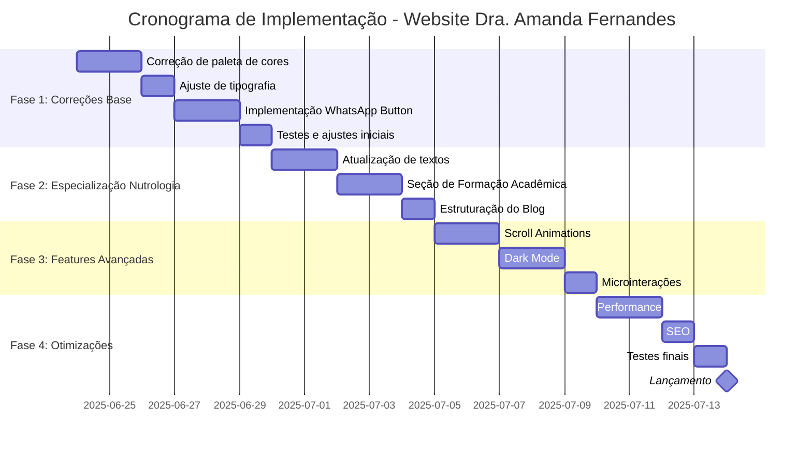
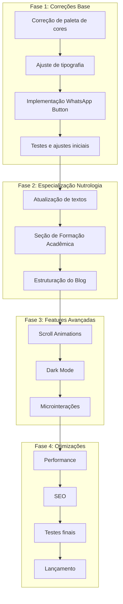
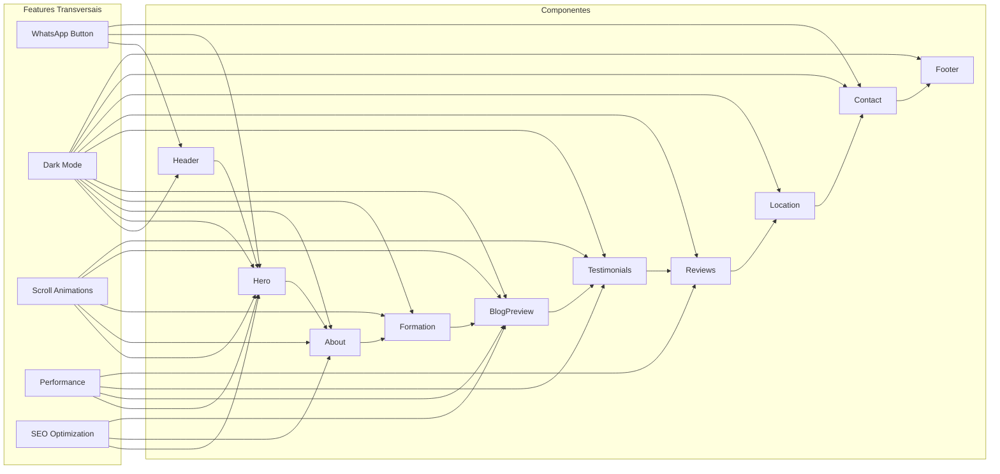
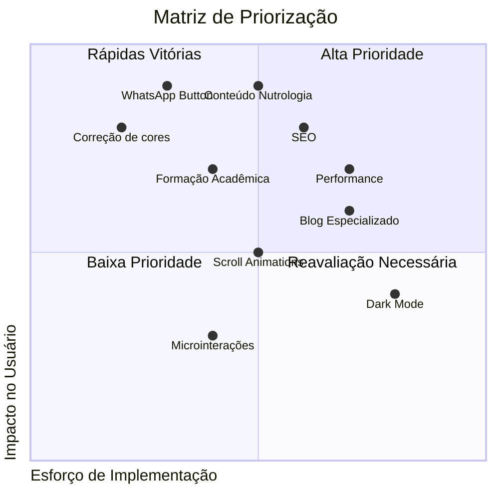
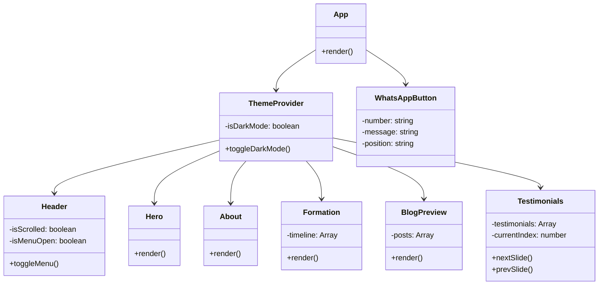
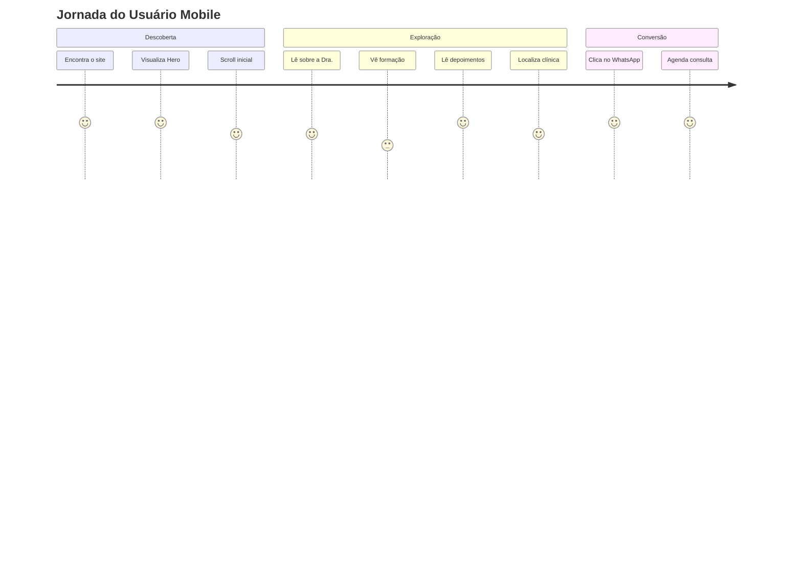
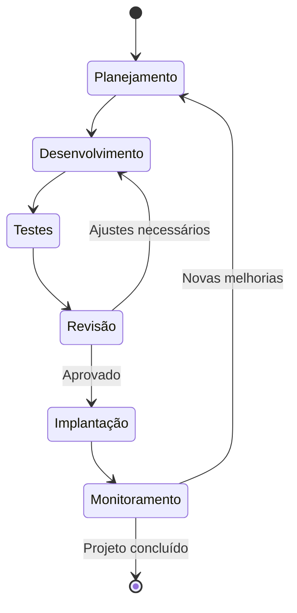

# 🗺️ ROADMAP DE IMPLEMENTAÇÃO - WEBSITE DRA. AMANDA FERNANDES

Este documento apresenta um roadmap visual detalhado para a implementação das transformações planejadas para o website da Dra. Amanda Fernandes, especialista em Nutrologia.

## 📊 VISÃO GERAL DO PROCESSO

## 🔄 FLUXO DE DEPENDÊNCIAS

## 📋 DETALHAMENTO POR COMPONENTE

## 🎯 PRIORIZAÇÃO DE TAREFAS

## 🧩 ARQUITETURA DE COMPONENTES

## 📱 FLUXO DE USUÁRIO MOBILE

## 🔄 CICLO DE DESENVOLVIMENTO

---

Este roadmap visual complementa o TRANSFORMATION_PLAN.md, oferecendo uma visão clara das dependências entre tarefas, prioridades e fluxo de trabalho para a implementação do website da Dra. Amanda Fernandes.