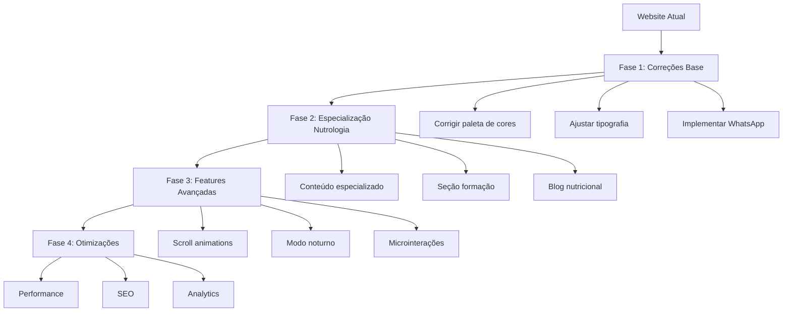

# 🌿 PLANO DE TRANSFORMAÇÃO DO WEBSITE - DRA. AMANDA FERNANDES (NUTROLOGIA)

> Este documento detalha o plano para transformar o website atual da Dra. Amanda em um site especializado em Nutrologia, mantendo a estrutura técnica que funciona bem e atualizando o conteúdo, design e funcionalidades para atender às especificações do briefing.

## 📊 ANÁLISE DO ESTADO ATUAL

### ✅ O que está funcionando bem:
- Estrutura React + TypeScript + Tailwind CSS (moderna e escalável)
- Sistema de roteamento com React Router
- Componentes modulares bem organizados
- Animações suaves (fade-in, slide-up)
- Design responsivo com menu mobile
- Header fixo com efeito blur
- Fontes já configuradas (Playfair Display + Inter)

### ❌ O que precisa ser ajustado:
- Paleta de cores (sage green está com valor incorreto: `#AA3B18A`)
- Conteúdo genérico de medicina geral → especializar para Nutrologia
- Falta integração com WhatsApp
- Ausência de seção de formação acadêmica na home
- Blog sem estrutura de conteúdo nutricional
- Falta modo noturno
- Sem scroll reveal animations
- Imagens genéricas ao invés de fotos da Dra. Amanda

## 🎯 ESTRATÉGIA DE TRANSFORMAÇÃO



## 📋 PLANO DETALHADO POR COMPONENTE

### 1. **Correções Fundamentais**

#### a) Tailwind Config
```javascript
// Corrigir cor sage green
colors: {
  cream: '#F6EDE4',
  sage: '#A3B18A', // valor correto
  'sage-dark': '#7A8A6A',
  'sage-light': '#C3D1AA',
  'brown-light': '#7B5544',
  'brown-dark': '#3D2B22',
}
```

#### b) WhatsApp Integration
- Criar componente `WhatsAppButton` flutuante
- Adicionar link com mensagem pré-formatada:
  ```
  https://wa.me/55NUMERO?text=Olá%20Dra.%20Amanda,%20gostaria%20de%20agendar%20uma%20consulta.
  ```
- Posição fixa no canto inferior direito
- Animação sutil de pulse para chamar atenção

### 2. **Header Component - Atualização**
- Atualizar menu para incluir:
  - INÍCIO
  - SOBRE
  - FORMAÇÃO
  - BLOG
  - CONSULTAS
  - LOCALIZAÇÃO
- Adicionar "Nutrologia" ao subtítulo do logo
- Manter comportamento de scroll e mobile menu

### 3. **Hero Component - Transformação**
- **Headline atual:** "Cuidando de você com excelência médica"
- **Nova headline:** "Nutrologia com ciência, equilíbrio e cuidado"
- **Subtexto:** "Transforme sua saúde através da nutrição médica personalizada e baseada em evidências científicas"
- **Stats:** Adaptar para métricas de Nutrologia
  - 1000+ Pacientes transformados
  - 10+ Anos em Nutrologia
  - 500+ Planos nutricionais personalizados
  - 98% Taxa de satisfação

### 4. **About Component - Especialização**
- Adicionar filosofia de trabalho em Nutrologia
- Destacar abordagem integrativa
- Mencionar medicina baseada em evidências
- Incluir certificações específicas
- Texto sobre a visão holística da nutrição
- Foto profissional da Dra. Amanda em ambiente clínico

### 5. **Novo Component: AcademicFormation**
- Timeline elegante com:
  - Graduação em Medicina
  - Especialização em Nutrologia
  - Cursos e certificações
  - Participações em congressos
- Ícones para cada etapa
- Animação de reveal ao scroll

### 6. **BlogPreview - Conteúdo Nutricional**
Categorias sugeridas:
- Nutrição funcional
- Emagrecimento saudável
- Suplementação inteligente
- Receitas médicas
- Mitos vs. Ciência

Estrutura de cards:
- Imagem relacionada ao tema
- Categoria com tag colorida
- Título do artigo
- Resumo curto
- Link "Ler mais" com animação de hover

### 7. **Testimonials - Casos de Sucesso**
- Depoimentos focados em transformações nutricionais
- Antes/depois (com consentimento)
- Resultados de exames melhorados
- Slider com controles de navegação
- Foto do paciente (opcional)
- Estrelas de avaliação

### 8. **Reviews - Avaliações Externas**
- Integração com Google Reviews
- Doctoralia badges
- Links para perfis externos
- Média de avaliações com estrelas

### 9. **Location Component - Clínica**
- Mapa Google Maps embed
- Endereço completo
- Horários de funcionamento
- Transporte público próximo
- Estacionamento
- Fotos da clínica

### 10. **Contact Component - WhatsApp First**
- Botão principal WhatsApp
- Texto orientativo sobre consultas
- Horários de atendimento
- Política de agendamento
- Formulário de contato alternativo
- Informações sobre convênios

### 11. **Footer - Atualização**
- Links para redes sociais
- Newsletter signup (opcional)
- Mapa do site
- Política de privacidade
- Termos de uso
- Copyright

## 🎨 SISTEMA DE DESIGN ATUALIZADO

### Paleta de Cores
```scss
// Paleta corrigida
$colors: (
  primary: #A3B18A,      // Sage green correto
  primary-dark: #7A8A6A,
  primary-light: #C3D1AA,
  background: #F6EDE4,
  white: #FFFFFF,
  text-dark: #3D2B22,
  text-light: #7B5544,
  success: #52C41A,
  warning: #FAAD14
);
```

### Tipografia
- **Títulos:** Playfair Display (400, 500, 600, 700)
- **Corpo:** Inter (300, 400, 500, 600)
- **Botões:** Inter Bold, uppercase, letter-spacing: 0.5px

### Componentes Visuais
- Cards com sombra suave e border-radius: 12px
- Botões com hover scale(1.05) e transição suave
- Links com underline animado (transform width)
- Imagens com overlay sutil
- Ícones consistentes (Lucide React)

## 🚀 FEATURES TÉCNICAS A IMPLEMENTAR

### 1. **Scroll Reveal (AOS.js alternative)**
```typescript
// Implementar com Intersection Observer
const useScrollReveal = () => {
  const [isVisible, setIsVisible] = useState(false);
  const ref = useRef<HTMLDivElement>(null);

  useEffect(() => {
    const observer = new IntersectionObserver(
      ([entry]) => {
        if (entry.isIntersecting) {
          setIsVisible(true);
          observer.disconnect();
        }
      },
      { threshold: 0.1 }
    );

    if (ref.current) {
      observer.observe(ref.current);
    }

    return () => {
      if (ref.current) {
        observer.unobserve(ref.current);
      }
    };
  }, []);

  return { ref, isVisible };
};

// Uso:
// const { ref, isVisible } = useScrollReveal();
// <div ref={ref} className={`transition-all duration-700 ${isVisible ? 'opacity-100 translate-y-0' : 'opacity-0 translate-y-10'}`}>
```

### 2. **Dark Mode**
```typescript
// Context API para tema
const ThemeContext = createContext({
  isDarkMode: false,
  toggleDarkMode: () => {},
});

// Provider
const ThemeProvider = ({ children }) => {
  const [isDarkMode, setIsDarkMode] = useState(false);
  
  useEffect(() => {
    // Check user preference
    const prefersDark = window.matchMedia('(prefers-color-scheme: dark)').matches;
    setIsDarkMode(prefersDark);
  }, []);
  
  const toggleDarkMode = () => {
    setIsDarkMode(!isDarkMode);
  };
  
  useEffect(() => {
    if (isDarkMode) {
      document.documentElement.classList.add('dark');
    } else {
      document.documentElement.classList.remove('dark');
    }
  }, [isDarkMode]);
  
  return (
    <ThemeContext.Provider value={{ isDarkMode, toggleDarkMode }}>
      {children}
    </ThemeContext.Provider>
  );
};

// Tailwind classes:
// className="bg-cream dark:bg-brown-dark text-brown-dark dark:text-cream"
```

### 3. **WhatsApp Integration**
```typescript
interface WhatsAppConfig {
  number: string;
  message: string;
  position: 'bottom-right' | 'bottom-left';
}

const WhatsAppButton: React.FC<WhatsAppConfig> = ({ 
  number, 
  message = "Olá Dra. Amanda, gostaria de agendar uma consulta.",
  position = "bottom-right" 
}) => {
  const encodedMessage = encodeURIComponent(message);
  const whatsappUrl = `https://wa.me/${number}?text=${encodedMessage}`;
  
  return (
    <a 
      href={whatsappUrl} 
      target="_blank"
      rel="noopener noreferrer"
      className={`fixed ${position === 'bottom-right' ? 'right-4' : 'left-4'} bottom-4 z-50 bg-green-500 text-white p-4 rounded-full shadow-lg hover:bg-green-600 transition-all duration-300 animate-pulse hover:animate-none`}
    >
      <WhatsAppIcon className="w-6 h-6" />
    </a>
  );
};
```

### 4. **Performance Optimizations**
- Lazy loading de imagens
  ```jsx
  
  ```
- Code splitting por rota
  ```jsx
  const Blog = React.lazy(() => import('./pages/Blog'));
  ```
- Preload de fontes críticas
- Compress images com WebP
- Minificação de assets

## 📱 MOBILE ENHANCEMENTS

### Bottom Navigation
- Implementar barra de navegação fixa no mobile
- Ícones + texto para as principais seções
- Botão de WhatsApp destacado no centro

### Touch Gestures
- Swipe para navegação em carrosséis
- Pull to refresh no blog
- Tap to call no telefone

### Otimizações Mobile
- Formulário de contato simplificado
- Botões com área de toque maior (48px min)
- Fontes ligeiramente maiores
- Espaçamento adaptativo

## 🔍 SEO & METADATA

### Meta Tags
```html
<!-- Meta tags específicas -->
<meta name="description" content="Dra. Amanda Fernandes - Especialista em Nutrologia. Transforme sua saúde com medicina nutricional personalizada.">
<meta name="keywords" content="nutrologia, nutrição médica, emagrecimento saudável, suplementação, saúde preventiva">
<meta property="og:title" content="Dra. Amanda Fernandes | Nutrologia">
<meta property="og:description" content="Especialista em Nutrologia com atendimento personalizado para transformar sua saúde através da nutrição médica.">
<meta property="og:image" content="/dra-amanda-og.jpg">
<meta property="og:url" content="https://draamandafernandes.com.br">
<meta name="twitter:card" content="summary_large_image">
```

### Schema.org
```html
<script type="application/ld+json">
{
  "@context": "https://schema.org",
  "@type": "Physician",
  "name": "Dra. Amanda Fernandes",
  "image": "https://draamandafernandes.com.br/images/dra-amanda.jpg",
  "url": "https://draamandafernandes.com.br",
  "telephone": "+55XXXXXXXXXX",
  "address": {
    "@type": "PostalAddress",
    "streetAddress": "Rua Exemplo, 123",
    "addressLocality": "São Paulo",
    "addressRegion": "SP",
    "postalCode": "01234-567",
    "addressCountry": "BR"
  },
  "geo": {
    "@type": "GeoCoordinates",
    "latitude": -23.5505,
    "longitude": -46.6333
  },
  "medicalSpecialty": "Nutrologia",
  "availableService": {
    "@type": "MedicalProcedure",
    "name": "Consulta de Nutrologia",
    "description": "Avaliação nutricional completa com plano personalizado"
  },
  "sameAs": [
    "https://www.instagram.com/draamandafernandes",
    "https://www.linkedin.com/in/draamandafernandes"
  ]
}
</script>
```

## 📊 MÉTRICAS DE SUCESSO

1. **Performance:**
   - Lighthouse score > 90
   - First Contentful Paint < 1.8s
   - Time to Interactive < 3.5s

2. **Acessibilidade:**
   - WCAG AA compliance
   - Contraste adequado
   - Navegação por teclado

3. **SEO:**
   - Rich snippets para médico
   - Posicionamento para termos de nutrologia
   - Estrutura de dados validada

4. **Conversão:**
   - Taxa de cliques no WhatsApp > 15%
   - Tempo médio no site > 2min
   - Bounce rate < 40%

## 🗓️ CRONOGRAMA SUGERIDO

### Semana 1: Correções Base + WhatsApp
- Dia 1-2: Correção de paleta de cores e tipografia
- Dia 3-4: Implementação do WhatsApp Button
- Dia 5: Testes e ajustes

### Semana 2: Especialização de Conteúdo
- Dia 1-2: Atualização de textos para Nutrologia
- Dia 3-4: Implementação da seção de Formação Acadêmica
- Dia 5: Estruturação do Blog

### Semana 3: Features Avançadas
- Dia 1-2: Implementação de Scroll Animations
- Dia 3-4: Implementação do Dark Mode
- Dia 5: Microinterações e refinamentos

### Semana 4: Testes e Otimizações
- Dia 1-2: Otimizações de performance
- Dia 3: Implementação de SEO
- Dia 4-5: Testes finais e lançamento

## 🔄 PRÓXIMOS PASSOS

1. Aprovação deste plano de transformação
2. Definição de prioridades e cronograma final
3. Início da implementação com o modo Code
4. Revisões periódicas do progresso
5. Testes com usuários reais
6. Lançamento e monitoramento

---

*Este plano foi desenvolvido para transformar o website da Dra. Amanda Fernandes em uma plataforma especializada em Nutrologia, mantendo a estrutura técnica atual e atualizando o conteúdo, design e funcionalidades para atender às especificações do briefing.*